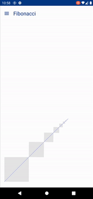

# Interactive Math

Inspired from [@physicsonly](https://www.instagram.com/physicsonly/). 
[https://www.instagram.com/reel/CTuSrCygZUb/](https://www.instagram.com/reel/CTuSrCygZUb/)

Implemented with Jetpack Compose. Tried different approaches but finally went with `Recursive Composables`
 

 

 

You can support me by buying me a coffee.

